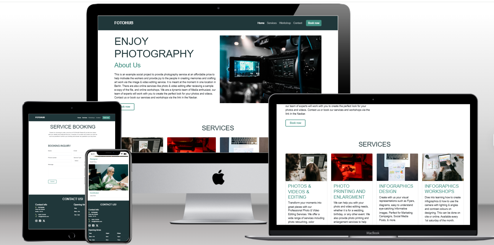
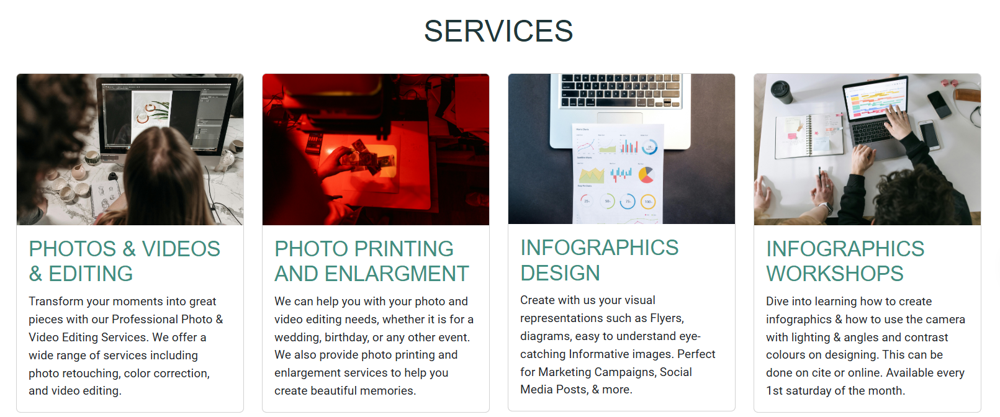
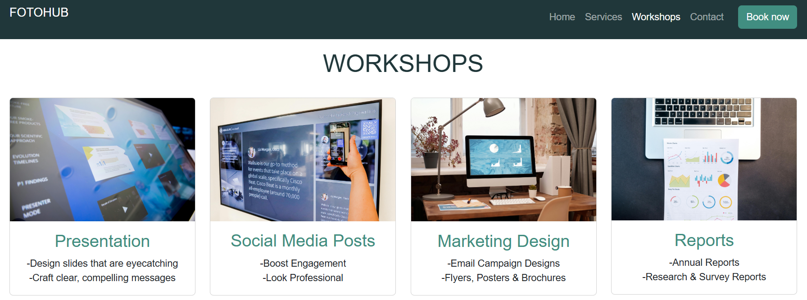
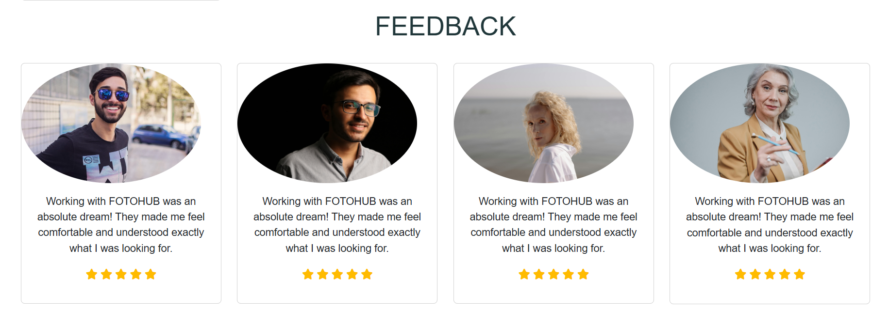
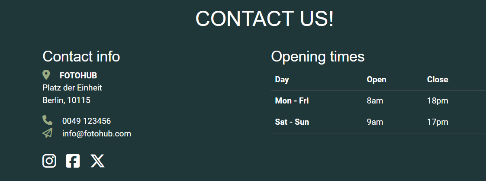
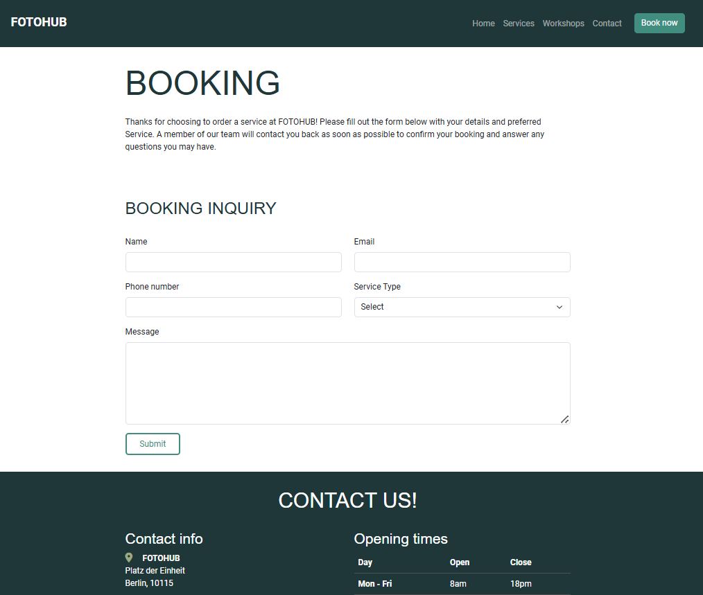
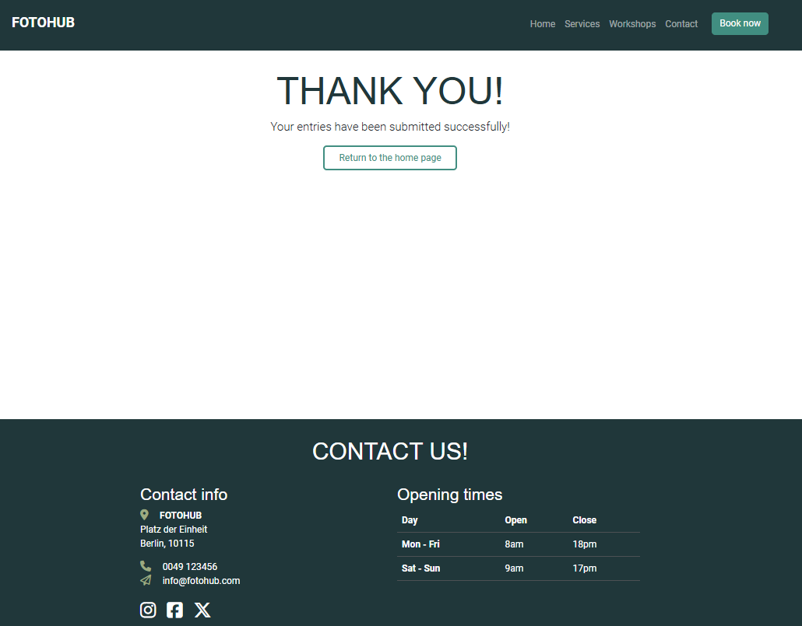
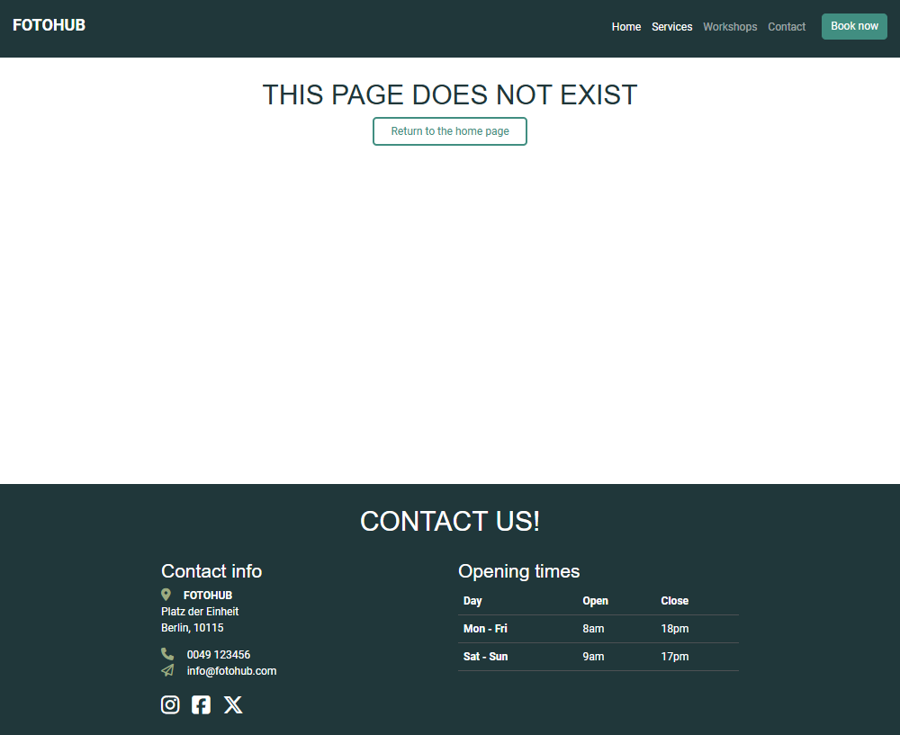
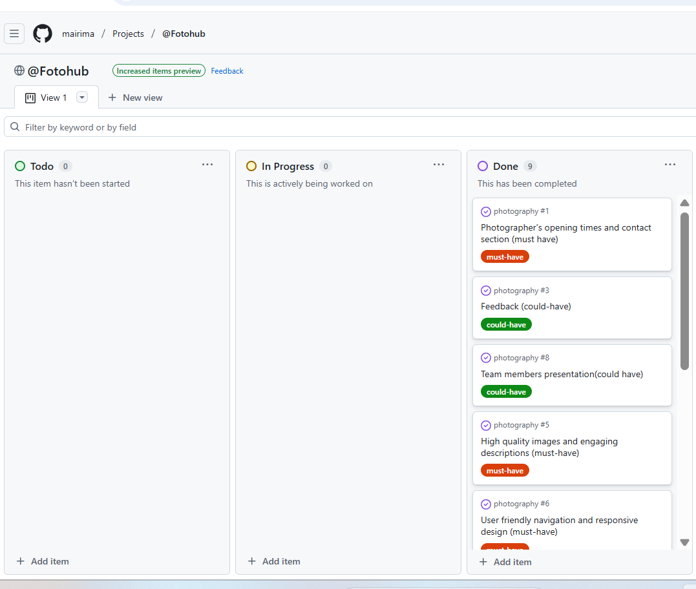
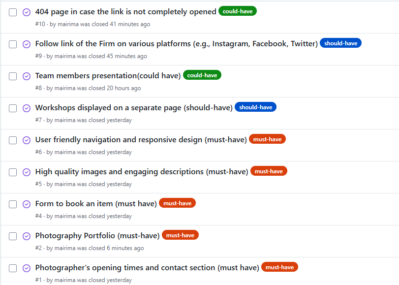

# [Photography](https://mairima.github.io/photography)

This is an example potential social project to provide photography service at an affordable price to help motivate the workers and volunteers and provide joy to the people in creating memories and crafting art work via the image & video editing service. It is meant at the moment in one location in Berlin. There are also online services like photo & video editing after recieving a sample e-copy of the file, and also online workshops. It is offered by a dynamic team of Media enthusiast, who create photos and videos for the interested people in the area and anywhere for online services. 
There is also a feedback section on the hompage.
It is a fictive website and all images where downloaded form pexels.com and text made myself and some with the help of chatgpt.

**Site Mockups**

source: [techsini](https://techsini.com/multi-mockup/index.php)

> [!IMPORTANT]
> The examples in these templates are strongly influenced by the Code Institute's walkthrough project called "Boardwalk games".

## UX

### The 5 Planes of UX

#### 1. Strategy Plane
##### Purpose
- Encourage users to visit the Photography and benefit from its services, workshops and members.
- Provide a good user experience to meet users need for digital services, handouts and learning.

##### Primary User Needs
- Take photos and videos
- Benefit from good photo and video editing results
- Print pictures in small and large sizes
- Benefit from the skills gained in the workshops

##### Business Goals
- Provide affordable photography services and print outs
- Share knowledge on skills that can be used for creativity

#### 2. Scope Plane
##### Features
- A full list of [Features](#features) can be viewed in detail below.

##### Content Requirements
- Clear, motivational text about the Firms mission to provide good and affordable photography services.
- Photos showcasing the Services.
- Workshop schedules and descriptions.
- Booking page.
- Feedback section

#### 3. Structure Plane
##### Information Architecture
- **Navigation Menu**:
  - Accessible links in the navbar.
- **Hierarchy**:
  - Clear call-to-action buttons.
  - Prominent placement of social media links in the footer.

##### User Flow
1. User lands on the home page, → learns about the Firms mission, → explores the team members
2. Navigates to the services section and sees services they can book.
3. Views the workshops on the workshop page.
4. Book the items form any page on the navbar Book now button.
4. Sees Feedback section.
5. Sees the contact section in the footer of all pages .

#### 4. Skeleton Plane
##### Wireframes

 

#### 5. Surface Plane
##### Visual Design Elements
- **[Colours](#colour-scheme)**: see below
- **[Typography](#typography)**: see below

### Colour Scheme

I used [coolors.co](https://coolors.co/080708-3772ff-df2935-fdca40-e6e8e6) to generate my color palette.

- `#000000` primary text.
- `#FFFFFF` primary highlights.
- `#418e81` secondary highlights.
- `20373a#` primary color.
- `#9caa81` secondary color.

### Typography

- [roboto](https://fonts.google.com/specimen/Roboto) was used for the primary headers and titles.
- [Regular 400](https://fonts.google.com/specimen/Roboto) was used for all other secondary text.
- [Font Awesome](https://fontawesome.com) icons were used throughout the site, such as the social media icons in the footer.

## User Stories

| Target | Expectation | Outcome |
| --- | --- | --- |
| As a user | I would like to see examples of services i can book with good quality images| so that I can decide what service is interesting for me.
| As a user | I would like to know how to book for a service| so that I can inform the Firm of my booking efficiently. |
| As a user | I would like to see opening times and contact details| so that I can get in contact if needed, and go at the opening times |
| As a user | I would like assess the site on various browsers or any other device | so i can easily use the site no matter the browser with which i access it. |
| As a user | I would like the website to be fully responsive | so that I can easily navigate and access information from my phone, tablet, or desktop. |
| As a user | i could be happy to see the employers, and users feedback| so that I can get familiar with the staff and trust the services |
| As a user |  I would like to follow the Firm on various platforms (e.g., Instagram, Facebook, Twitter) | so that I can stay updated with Firms services and events. |
| As a user | I would like to see a 404 error page if I get lost | so that it's obvious that I've stumbled upon a page that doesn't exist. |

## Features

### Existing Features

| Feature | Notes | Screenshot |
| --- | --- | --- |
| Navbar | Featured on all three pages, the full responsive navigation bar includes links to the Logo, Home page, Service, and Workshop page, and is identical in each page to allow for easy navigation. On the smallest screens, a burger icon is used to toggle the navbar so it doesn't take up too much space. This section will allow the user to easily navigate from page to page across all devices without having to revert back to the previous page via the "back" button. |   |
| Service images | The landing includes photos and texts of services to allow the user to see exactly which services are offered. This section introduces the user to *Photography* with an eye-catching carousel animation to grab their attention. |  |
| Workshops | This section will allow the user to see exactly what workshops will happen,they will take place online as described in the About us section. This section will be updated in case of changes to keep the user up to date. |  |
| Feedback| This section will showcase clients and feedback|  |
| Footer | The footer includes links to the relevant social media sites for *photography*. The links will open in a new tab to allow easy navigation for the user. The footer is valuable to the user, as it encourages them to keep connected via social media. |  |
| Booking| This page will allow the user to book in *Fotohub* and start their running journey with the community. The user will be able specify if they would like to order the service and or workshop in the message. The user will be asked to submit their full name and email address. |  |
| Confirmation | The confirmation page will give the illusion that the booking form was submitted successfully to the *Fotohub* Firm. Due to the lack of a database or email system so far, this is a fake confirmation page.. |  |
| 404 | The 404 error page will indicate when a user has somehow navigated to a page that doesn't exist. This replaces the default GitHub Pages 404 page, and ties-in with the look and feel of the *Fotohubg* site by using the standard navbar and footer. |  |

### Future Features

- **Personalized User Profiles**: Allow users to create accounts where they can track their booking.
- **Training Plans**: Offer customizable training plans for members, with notifications and reminders.
- **Event Registration & Payment**: Integrate an option for members to register and pay for upcoming workshops or services.
- **Achievements & Badges**: Introduce a gamification system where users earn badges or achievements for reaching milestones (e.g., number of services and workshops booked).
- **Interactive Maps**: Display interactive maps, in case of new locations where users can choose the closest location.
- **Blog**: Include a blog section for members to share their experiences, tips, and stories, fostering community engagement.
- **Weekly Challenges**: Implement weekly challenges or group challenges to keep users motivated and engaged.
- **Weather Integration**: Show local weather conditions for Berlin and suggest the best times for outdoor photography, based on user preferences.
- **Social Sharing**: Enable users to share their achievements, or workshop participation directly on social media from the site.
- **Club Merchandise Store**: Introduce an online store where users can purchase the online services
- **Push Notifications**: Allow users to opt-in for mobile push notifications for updates, new services anf workshops, or motivational reminders.
- **Member Forums or Groups**: Introduce discussion boards or group chats for members to connect, discuss upcoming events.
- **Charity Partnerships**: Offer integration of donations where members can donate for specific causes.

## Tools & Technologies

| Tool / Tech | Use |
| --- | --- |
|  | Generate README and TESTING templates. |
|  | Version control. (`git add`, `git commit`, `git push`) |
|  | Secure online code storage. |
|  | Main site content and layout. |
|  | Design and layout. |
|  | Hosting the deployed front-end site. |
|VS Code | Writing the code for html, css and bootstrap and all the content. |
|Bootstrap | Complementing the css and framework for parts of the website like the carousel|

## Agile Development Process

### GitHub Projects

[GitHub Projects](https://www.github.com/mairima/photography/projects) served as an Agile tool for this project. Through it, EPICs, User Stories, issues/bugs, and Milestone tasks were planned, then subsequently tracked on a regular basis using the Kanban project board.

### GitHub Issues

[GitHub Issues](https://github.com/users/mairima/projects/3/views/1) served as another Agile tool. There, I managed my User Stories and Milestone tasks, and tracked any issues/bugs.

GitHub closed issues:

  |

### MoSCoW Prioritization

I've decomposed my Epics into User Stories for prioritizing and implementing them. Using this approach, I was able to apply "MoSCoW" prioritization and labels to my User Stories within the Issues tab.

- **Must Have**: guaranteed to be delivered - required to Pass the project (*max ~60% of stories*)
- **Should Have**: adds significant value, but not vital (*~20% of stories*)
- **Could Have**: has small impact if left out (*the rest ~20% of stories*)

## Testing

> [!NOTE]
> For all testing, please refer to the [TESTING.md](TESTING.md) file.

## Deployment

### GitHub Pages

The site was deployed to GitHub Pages. The steps to deploy are as follows:

- In the [GitHub repository](https://www.github.com/mairima/photography), navigate to the "Settings" tab.
- In Settings, click on the "Pages" link from the menu on the left.
- From the "Build and deployment" section, click the drop-down called "Branch", and select the **main** branch, then click "Save".
- The page will be automatically refreshed with a detailed message display to indicate the successful deployment.
- Allow up to 5 minutes for the site to fully deploy.

The live link can be found on [GitHub Pages](https://mairima.github.io/photography).

### Local Development

This project can be cloned or forked in order to make a local copy on your own system.

#### Cloning

You can clone the repository by following these steps:

1. Go to the [GitHub repository](https://www.github.com/mairima/photography).
2. Locate and click on the green "Code" button at the very top, above the commits and files.
3. Select whether you prefer to clone using "HTTPS", "SSH", or "GitHub CLI", and click the "copy" button to copy the URL to your clipboard.
4. Open "Git Bash" or "Terminal".
5. Change the current working directory to the location where you want the cloned directory.
6. In your IDE Terminal, type the following command to clone the repository:
	- `git clone https://www.github.com/mairima/photography.git`
7. Press "Enter" to create your local clone.

Alternatively, if using Gitpod, you can click below to create your own workspace using this repository.

**Please Note**: in order to directly open the project in Gitpod, you should have the browser extension installed. A tutorial on how to do that can be found [here](https://www.gitpod.io/docs/configure/user-settings/browser-extension).

#### Forking

By forking the GitHub Repository, you make a copy of the original repository on our GitHub account to view and/or make changes without affecting the original owner's repository. You can fork this repository by using the following steps:

1. Log in to GitHub and locate the [GitHub Repository](https://www.github.com/mairima/photography).
2. At the top of the Repository, just below the "Settings" button on the menu, locate and click the "Fork" Button.
3. Once clicked, you should now have a copy of the original repository in your own GitHub account!

### Local VS Deployment

There are no remaining major differences between the local version when compared to the deployed version online.

## Credits
The pictures where taken from the open source pexels.com website.
The structure of the page was oriented from the Boardwalk game page from the Code Institute walkthrough methods.

### Content

| Source | Notes |
| --- | --- |
| [Markdown Builder](https://markdown.2bn.dev) | Help generating Markdown files |
| [Code Institute LMS](https://chris.beams.io/posts/git-commit) | "How to Write a Git Commit Message" |
| [Boardwalk Game](https://codeinstitute.net) | Code Institute walkthrough project inspiration |
| [ChatGPT](https://chatgpt.com) | Help with text formation |

### Media

| Source | Notes |
| --- | --- |
| [favicon.io](https://favicon.io) | Generating the favicon |
| [Font Awesome](https://fontawesome.com) | Icons used throughout the site |
| [Pexels](https://www.pexels.com/de-de/) | Help with open source images carousel |
| [Pexels](https://www.pexels.com/photo/studio-setting-2388569/) | Help with open source images for carousel |
| [Pexels](https://www.pexels.com/search/graduation%20foto%20shooting%20with%20professional%20camera/) | Help with open source images carousel|
| [Pexels](https://www.pexels.com/photo/close-up-photo-of-formal-table-setting-735869/) | Help with open source images carousel|
| [Pexels](https://www.pexels.com/photo/a-woman-taking-photo-13461082/) | Help with open source images carousel |
| [Pexels](https://www.pexels.com/photo/people-sitting-on-gang-chairs-2774556/) | Help with open source images carousel |
| [Pexels]( https://www.pexels.com/photo/a-person-editing-a-photo-using-a-computer-7675078/) | Help with open source images Services |
| [Pexels](https://www.pexels.com/photo/person-holding-white-and-red-card-7206195/) | Help with open source images Services |
| [Pexels](https://www.pexels.com/photo/paper-on-gray-laptop-669617/) | Help with open source images Services |
| [Pexels](https://www.pexels.com/photo/person-in-black-long-sleeve-shirt-using-macbook-pro-7213549/) | Help with open source images Services |
| [Pexels](https://www.pexels.com/photo/paper-on-gray-laptop-669617/) | Help with open source images Workshop |
| [Pexels](https://www.pexels.com/photo/icons-on-touchscreen-14851415/) | Help with open source images Workshop |
| [Pexels](https://www.pexels.com/photo/person-scanning-qr-code-from-screen-15467761/) | Help with open source images Workshop|
| [Pexels](https://www.pexels.com/photo/simple-workspace-at-home-6476587/) | Help with open source images Workshop|
| [Pexels](https://www.pexels.com/photo/close-up-photography-of-man-wearing-sunglasses-1212984/) | Help with open source images-Feedback section |
| [Pexels](https://www.pexels.com/photo/man-wearing-eyeglasses-and-polo-shirt-2117283/) | Help with open source images-Feedback section |
| [Pexels](https://www.pexels.com/photo/woman-in-white-shirt-standing-near-body-of-water-5263312/) | Help with open source images-Feedback section |
| [Pexels](https://www.pexels.com/photo/portrait-of-elderly-woman-in-brown-blazer-holding-a-notebook-8424881/) | Help with open source images-Feedback section |

### Acknowledgements

- I would like to thank my Code Institute mentor, [Tim Nelson](https://www.github.com/TravelTimN) for the support throughout the development of this project.
- I would like to thank the My facilitator Kay for the support throughout the development of this project.
- I would like to thank the [Code Institute](https://codeinstitute.net) Tutor Team for their assistance with troubleshooting and debugging some project issues.
- I would like to thank the [Code Institute Slack community](https://code-institute-room.slack.com) for the moral support; it kept me going during periods of self doubt and impostor syndrome.
- I would like to thank my family for the moral support.
- I would like to thank my employer, for supporting me in my career development towards becoming a software developer.

