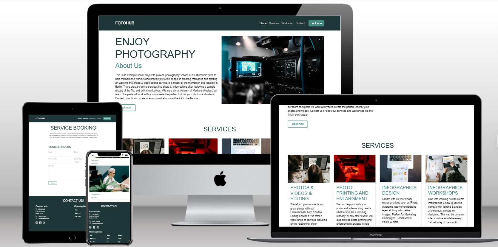

# Testing

> [!NOTE]
> Return back to the [README.md](README.md) file.

I have conducted enough manual testing to and believe that the site works well. All sections like navbar buttons and booking page works well as expected. The images in the carousel also shows well and all other images are presented well. The website is intuitive for the user experience and users can easily see the service provided and click on the booking page when needed, the contact details in the footer section and the about us section and team members can be seen easily. 

## Code Validation

### HTML
Index HTML, Booking, and Workshop pages results are positive: 
- https://validator.w3.org/nu/?doc=https://mairima.github.io/photography/index.html

I have used the recommended [HTML W3C Validator](https://validator.w3.org) to validate all of my HTML files.

| Directory | File | URL | Screenshot | Notes |
| --- | --- | --- | --- | --- |
| --- | --- | --- | --- | --- |
|  | [404.html](https://github.com/mairima/photography/blob/main/404.html) | [HTML Validator](https://validator.w3.org/nu/?doc=https://mairima.github.io/photography/404.html) |  | positive |
|  | [booking.html](https://github.com/mairima/photography/blob/main/booking.html) | [HTML Validator](https://validator.w3.org/nu/?doc=https://mairima.github.io/photography/booking.html) |  | positive |
|  | [index.html](https://github.com/mairima/photography/blob/main/index.html) | [HTML Validator](https://validator.w3.org/nu/?doc=https://mairima.github.io/photography/index.html) |  | positive|
|  | [workshop.html](https://github.com/mairima/photography/blob/main/workshop.html) | [HTML Validator](https://validator.w3.org/nu/?doc=https://mairima.github.io/photography/workshop.html) |  | positive|
|  | [success.html](https://mairima.github.io/photography/success.html) | [HTML Validator](https://validator.w3.org/nu/?doc=https://mairima.github.io/photography/success.html) |  | positive|

### CSS

The Jigsaw validator for the page is positive without any errors. 

- https://jigsaw.w3.org/css-validator/validator?uri=https://mairima.github.io/photography

I have used the recommended [CSS Jigsaw Validator](https://jigsaw.w3.org/css-validator) to validate all of my CSS files.

| Directory | File | URL | Screenshot | Notes |
| --- | --- | --- | --- | --- |
| assets | [style.css](https://github.com/mairima/photography/blob/main/assets/css/style.css) | [CSS Validator](https://jigsaw.w3.org/css-validator/validator?uri=https://mairima.github.io/photography) |  | positive |

## Responsiveness

I've tested my deployed project to check for responsiveness issues.

| Page | Mobile | Tablet | Desktop | Notes |
| --- | --- | --- | --- | --- |
| Home | ok | ok |ok | Works as expected |
| Workshop | ok |ok | ok | Works as expected |
| Booking | ok | ok |ok  | Works as expected |
| Servces | ok | ok | ok | Works as expected |
|Feedback | ok | ok | ok | Works as expected |
| 404 | ok |  ok| ok | Works as expected |

## Browser Compatibility

I've tested my deployed project on multiple browsers to check for compatibility issues.

| Page | Chrome | Firefox | Safari | Notes |
| --- | --- | --- | --- | --- |
| Home | ok | ok |ok | Works as expected |
| Workshop |ok  |ok  |ok | Works as expected |
| Booking | ok |  ok|ok  | Works as expected |
| Success | ok |ok  |ok | Works as expected |
| 404 | ok | ok | ok|works as expected |

## Lighthouse Audit

I've tested my deployed project using the Lighthouse Audit tool to check for any major issues. Some warnings are outside of my control, and mobile results tend to be lower than desktop.

|Page| | Desktop |
| --- | --- | --- |
|Home|      |ok|
|Workshop|  |ok|
|Booking|   |ok|
|Success|   |ok|
|404|       |ok|

## Defensive Programming

Defensive programming was manually tested with the below user acceptance testing:

| Page | Expectation | Test | Result | Note |
| --- | --- |  --- |  --- |  --- |
| Home | Feature is expected to display examples of why users should join. | Verified that the page displays the Firms mission and purpose in a clear and concise manner. | The mission and purpose were displayed as expected. |ok|
| | Feature is expected to have accessible navigation links. | Checked navigation links for correct functionality and accessibility. | Navigation links were functional and accessible. | ok |
| | Feature is expected to be fully responsive. | Resized the browser window and tested on multiple devices (mobile, tablet, desktop). | The page was responsive across all tested screen sizes. | ok|
| Services | Feature is expected to display details of different services offered. | Verified that the page lists all services with relevant details. | Details were displayed as expected. | ok |
| Workshop | Feature is expected to showcase a gallery of actual workshops and short description. | Verified that the Workshop contains clear images and text that aren't stretched, pixelated, and fully responsive. | Images are properly sized, and respond well to different device sizes. |ok|
| Booking| Feature is expected to enforce valid input types for each field. | Entered invalid data (e.g., random text in an email field, numbers in a name field, etc.). | Error messages were displayed appropriately, and submission was blocked. |ok|
| Feedback| Feature is expected to enforce valid input types for show past clients and texts | Verified that the Workshop contains clear images and text that aren't stretched, pixelated, and fully responsive. |Images are properly sized, and respond well to different device sizes. |ok|
| Social Links | Feature is expected to include working links to the club’s social platforms (Instagram, Facebook, etc.). | Clicked each social link to verify redirection to the correct platform page. | All links redirected to the correct platform pages, opening in new browser tabs. |ok|
| 404 Error Page | Feature is expected to display a 404 error page for non-existent pages. | Navigated to an invalid URL (e.g., `/test`) to test error handling. | A custom 404 error page was displayed as expected. |ok|

## User Story Testing

| Target | Expectation | Outcome | Screenshot | 
| --- | --- | --- | --- | 
| As a user | I would like to see examples of services i can book | so that I can decide what service is interesting for me. |ok|
| As a user | I would like to Know how to book for a service| so that I can inform the Firm of my booking efficiently |ok|
| As a user | I would like to see the deatils of contact| so that I can get in contact if needed. |ok|
| As a user | I would like to view a gallery elements| So that i can have a reference of what can be offered |ok|
| As a user | I would like assess the site on various browsers or any other device | so i can easily use the site no matter the browser with which i access it. |ok|
| As a user | I would like to follow the Firm on various platforms (e.g., Instagram, Facebook, Twitter) | so that I can stay updated with Firms services and events. |ok|
| As a user | I would like the website to be fully responsive | so that I can easily navigate and access information from my phone, tablet, or desktop. |ok|
| As a user | I would like to see feedbacks | so that I can be convinced about the services|ok|
| As a user | I would like to see a 404 error page if I get lost | so that it's obvious that I've stumbled upon a page that doesn't exist. |ok|

> [!IMPORTANT]
> There are no remaining bugs that I am aware of.
